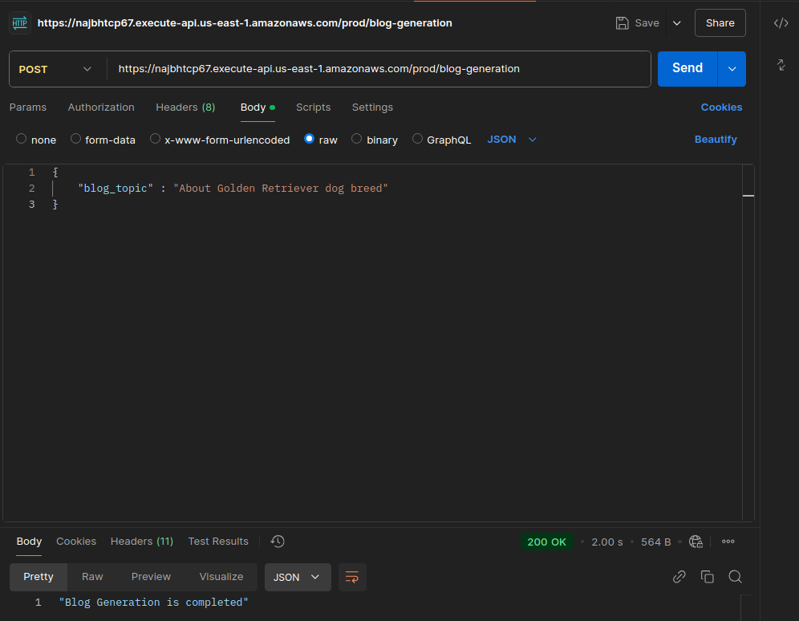

# Blog generations into S3 bucket

## Architecture

- APGW -> Lambda -> Bedrock -> Lambda -> s3

## Deployments

- IAM roles for API Gateway can invoke Lambda
- IAM roles for Lambda to invoke Bedrock
- IAM roles for Lambda to create and save S3 bucket

## CDK deployment

- Must install `Docker` and give `docker` proper running permission before `npx cdk deploy`
- `boto3` is given inside Lambda runtime will likely not having up-to-date libraries to run certain bedrock models.
- Therefore, we do use python docker, to bundle the lambda image with existing latest `boto3` at the moment.

## Execution

- Using postman to invoke API Gateway proxy for Lambda function
- 
