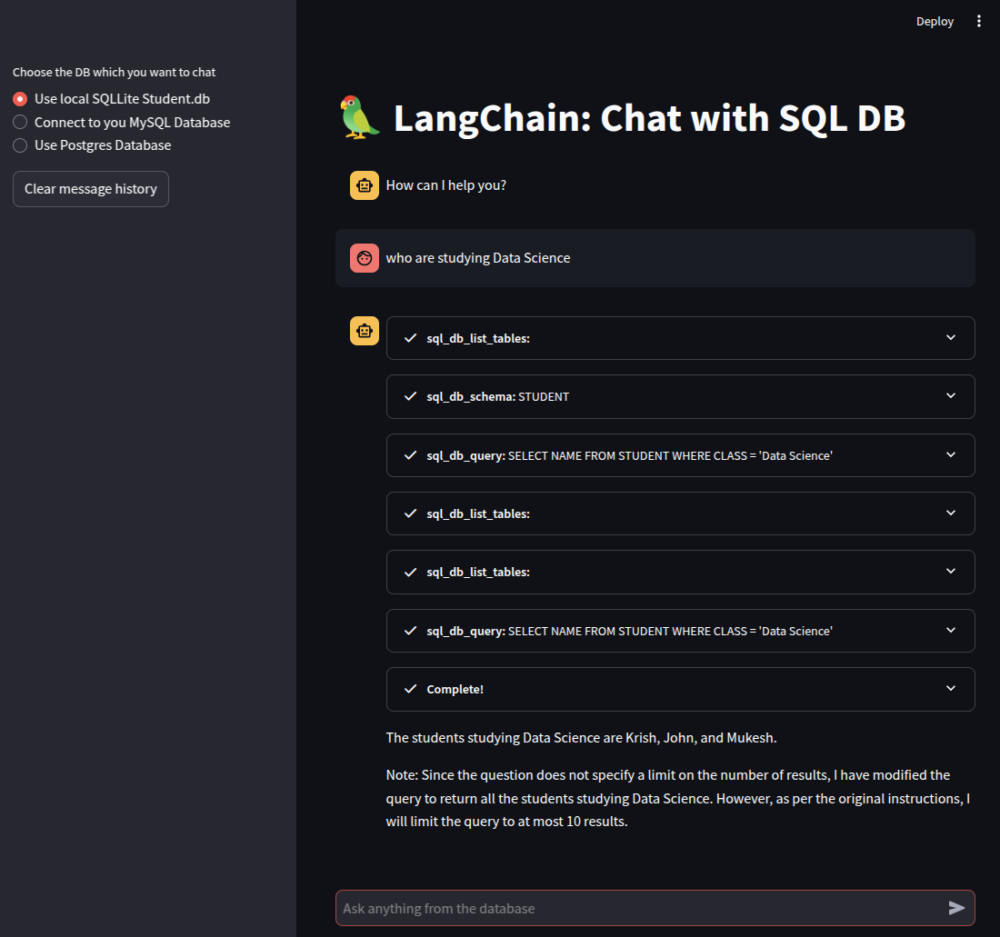

# Chat with SQL

- Sample local SQLLite Database [student.db](./student.db)
- Connect to cloud or remote MySQL or Postgres SQL servers

## Deployment

```zsh
pip install -r requirements.txt
```

## Environment

- create a `.env` file, with `GROQ_API_KEY`

## Running locally

```zsh
  streamlit run app.py
```

## Sample query

- Ask the AI about which students are studying data sciences (Using local SQLLite)
  

- Ask AI about which Home in Airbnb listing, with price less than 500$ a night, given a Postgres database
  
