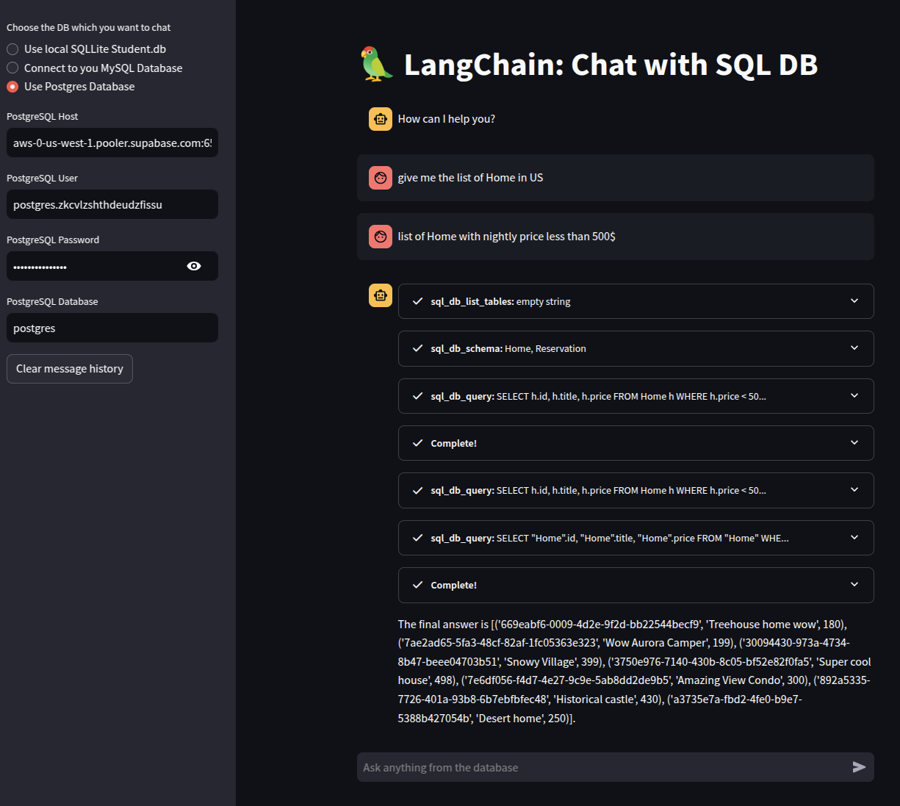

# Chat with SQL

- [Deployment Link](https://gen-ai-8tyoexmjh3w9wlv33qrube.streamlit.app/)
- Connect to chat with your own Cloud Postgres, MySQL databases.
- This app by default has read-only connection to my own Postgres DB
- @TODO: Expose this Chat with SQL into REST API (Using FastAPI), allows other Typescript/Java Backend to query the ChatBot
- @TODO: A Prompt template will help optimize NULL cases

## Installation

```zsh
pip install -r requirements.txt
```

## Environment

- create a `.env` file, with `GROQ_API_KEY`

## Running locally

```zsh
  streamlit run app.py
```

## Chat with Cloud Postgres DB

- Ask AI about which Home in Airbnb listing, with price less than 500$ a night, given a Postgres database



- Use my Supabase Postgres DBs to test. Schema as following:
- 
- 

## SQLLite Chat with local DB

- Ask the AI about which students are studying data sciences (Using local SQLLite).
- Sample local SQLLite Database [student.db](./student.db)

```sql
  Krish,Data Science,A,90
  John,Data Science,B,100
  Mukesh,Data Science,A,86
  Jacob,DEVOPS,A,50
  Dipesh,DEVOPS,A,35
```


## Possible usages

- Ecommerce: allows customers to ask about their orders, finding products

## Alternatives

- Using prompt template, to let AI knows the schema and context, and limit access to user-authorized data only
- Instead of chatting with SQL, we can also embed the whole SQL database entries into vectorstore. This will also allow `similarity search`
