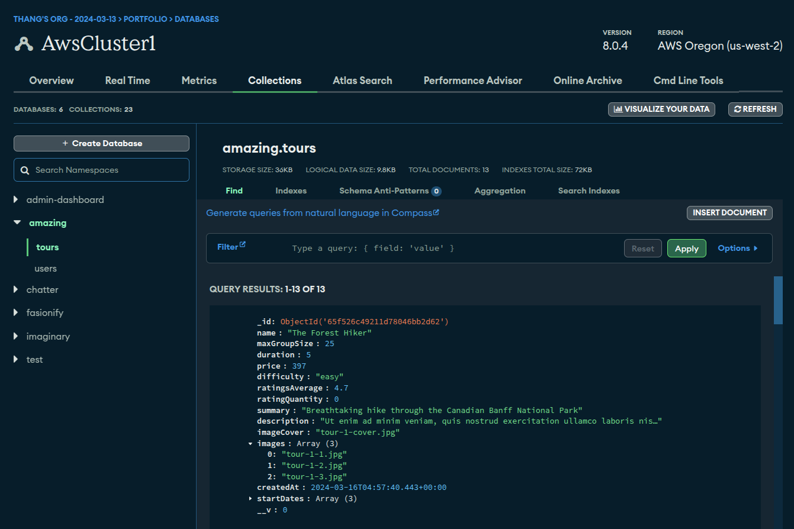
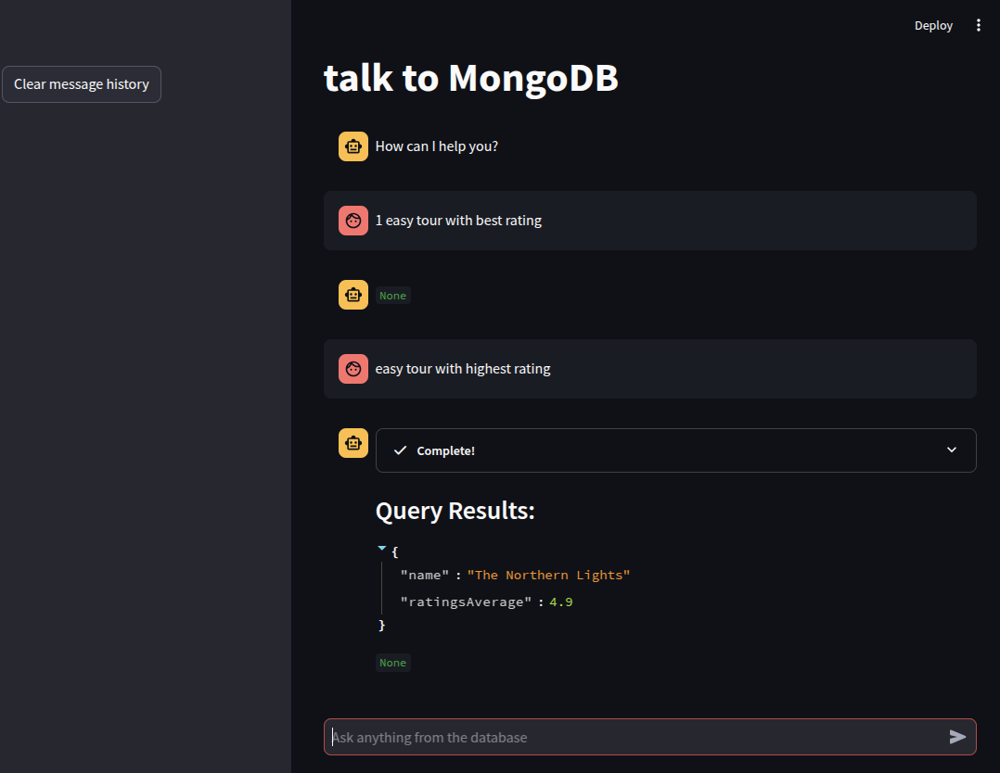

# Tutorial for Chatting with MongoDB using prompt template

-   Maintain chat history with langchain tools and agents with Deekseek open-source model: [app-groq](./app_groq.py)
-   Simple solution with OpenAI: [app-openAI.py](./app_openAI.py)

## Reference Youtube Tutorial

[Guide to chat with MongoDB](https://www.youtube.com/watch?v=fUx1orae5nY&t=210s)

## Testing Mongo Schema

-   Hiking tour database, Database=`amazing`, collection=`tours`
    

-   Chatbot query example:
    

-   JSON structure of tours:

```JSON
{
  "_id": {
    "$oid": "65f526c49211d78046bb2d62"
  },
  "name": "The Forest Hiker",
  "maxGroupSize": {
    "$numberInt": "25"
  },
  "duration": {
    "$numberInt": "5"
  },
  "price": {
    "$numberInt": "397"
  },
  "difficulty": "easy",
  "ratingsAverage": {
    "$numberDouble": "4.7"
  },
  "ratingQuantity": {
    "$numberInt": "0"
  },
  "summary": "Breathtaking hike through the Canadian Banff National Park",
  "description": "Ut enim ad minim veniam, quis nostrud exercitation ullamco laboris nisi ut aliquip ex ea commodo consequat. Duis aute irure dolor in reprehenderit in voluptate velit esse cillum dolore eu fugiat nulla pariatur.\nLorem ipsum dolor sit amet, consectetur adipisicing elit, sed do eiusmod tempor incididunt ut labore et dolore magna aliqua. Excepteur sint occaecat cupidatat non proident, sunt in culpa qui officia deserunt mollit anim id est laborum.",
  "imageCover": "tour-1-cover.jpg",
  "images": [
    "tour-1-1.jpg",
    "tour-1-2.jpg",
    "tour-1-3.jpg"
  ],
  "createdAt": {
    "$date": {
      "$numberLong": "1710565060443"
    }
  },
  "startDates": [
    {
      "$date": {
        "$numberLong": "1619370000000"
      }
    },
    {
      "$date": {
        "$numberLong": "1626800400000"
      }
    },
    {
      "$date": {
        "$numberLong": "1633453200000"
      }
    }
  ],
  "__v": {
    "$numberInt": "0"
  }
}
```

## Notes

-   This method does not embed vectors to MongoDB, thus it is not optimized for `semantic search`
-   Unlike SQL database, where AI agent can retrieve schema automatically, MongoDB query require prompt engineering.
-   Alternative: use a vectorstore retriever to create a RAG chain. See [6-Chatbot-History](../6-Chatbot-History/3-History_Retriever-Conversations.ipynb)
