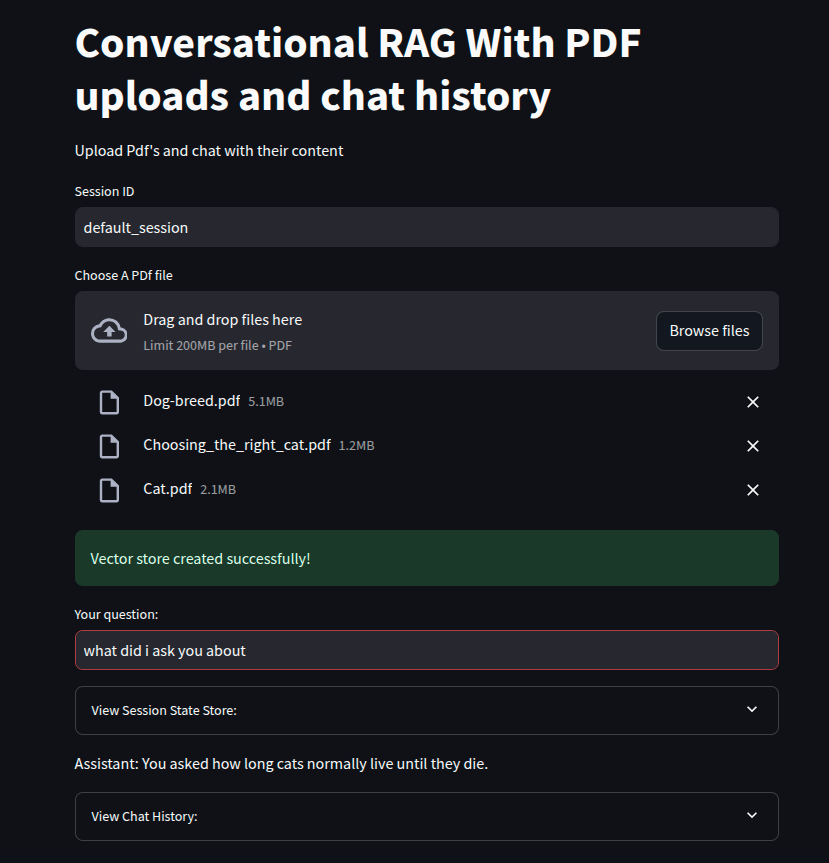

# Streamlit app to upload pdf files and have history conversation with PDF

## Running

```bash
  streamlit run app.py
```

- Use any pdf, or using [pdf-assets folder](../pdf-assets/) to upload pdf to the Chatbot
- 
