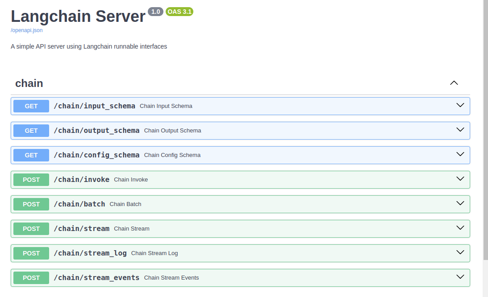

# Langchain Basis

## Installation

```bash
  conda create -p venv python==3.12
  conda activate venv/
  pip install -r requirements.txt
```

- Lock in dependencies in `requirements-lock.txt`:

```bash
  conda list --export > requirements-lock.txt
```

## Ollama open source models

- [Github Ollama models list](https://github.com/ollama/ollama?tab=readme-ov-file#model-library)
- [Download Ollama](https://ollama.com/download/linux)
- For example: Download `gemma2` 2 Billion parameters:

```bash
  ollama pull gemma2:2b
```

or running directly from remote source:

```bash
  ollama run gemma2:2b
```

- `ollama pull”` fetches a model or image from a remote source. “ollama run” executes that model locally once it has already been pulled.

## [Faiss installation](https://github.com/facebookresearch/faiss/blob/main/INSTALL.md)

```bash
# GPU(+CPU) version
$ conda install -c pytorch -c nvidia faiss-gpu=1.9.0
```

or

```bash
pip install faiss-gpu-cu12
```

## Setup Environment for LangChain

- [LangSmith Environment Setup](https://docs.smith.langchain.com/#3-set-up-your-environment)

```.env
  export LANGCHAIN_TRACING_V2=true
  export LANGCHAIN_API_KEY=<your-api-key>
```

## Using LangServe to create REST API for GenAI applications

```bash
  python serve.py
```

- `langserve` will expose the SWAGGER docs at `127.0.0.1/docs`
- 

## Ollama Local Embeddings

```python
from langchain_community.embeddings import OllamaEmbeddings

embeddings = OllamaEmbeddings(model="llama2")  # or specific llama3 model name
```

## Online Embeddings

- Example: OpenAIEmbeddings, HuggingFace
- The "all-MiniLM-L6-v2" is a sentence transformer model that works independently of LLM
- This can also be embedded locally:

```python
  %pip install -U sentence-transformers
  from sentence_transformers import SentenceTransformer
  sentences = ["This is an example sentence", "Each sentence is converted"]

  model = SentenceTransformer('sentence-transformers/all-MiniLM-L6-v2')
  embeddings = model.encode(sentences)
  print(embeddings)
```
